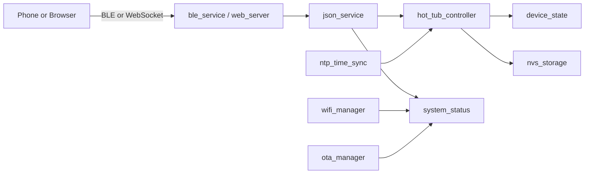
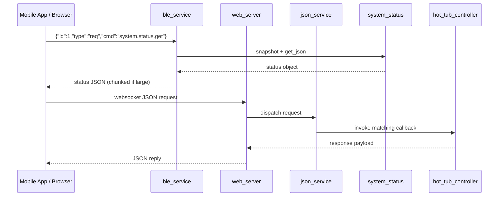
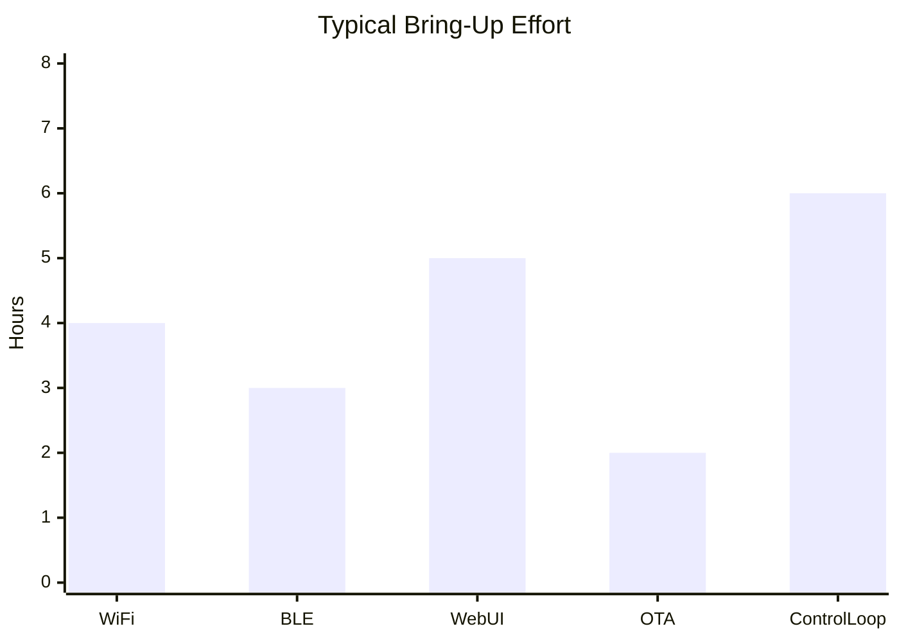

# ESP32-S3 Hot Tub Controller

This project is a full firmware and web UI stack for a hot tub controller built on ESP-IDF + FreeRTOS.

It includes:
- Wi-Fi networking (STA and AP fallback)
- BLE control and telemetry
- Web dashboard with WebSocket updates and live charting
- JSON RPC service for cross-module commands
- OTA update pipeline with rollback safety
- Persistent storage and status reporting

## 1) Beginner Mental Model

Think of the firmware as a team of small workers (components).
Each worker has one job and talks to others using simple JSON messages and shared status structures.



## 2) How Data Moves Through the App



## 3) Quick Start

1. Install ESP-IDF 5.5 toolchain.
2. Open this folder in VS Code.
3. Build firmware.
4. Flash firmware.
5. Connect via:
	 - Web UI over Wi-Fi, or
	 - BLE terminal app for direct command testing.

Typical commands:

```bash
idf.py set-target esp32s3
idf.py build
idf.py flash monitor
```

## 4) Runtime Interfaces

### BLE
- Service provides RX (write/read) and TX (notify).
- Supports plain JSON requests and command text shortcuts.
- Large responses are split using BEGIN/CHUNK/END framing.

### WebSocket
- Browser sends JSON request envelopes.
- Server and JSON dispatcher route to module callbacks.

### JSON Envelope Example

```json
{"id":1,"type":"req","cmd":"system.status.get","params":""}
```

## 5) Component Documentation

Each component now has its own beginner-friendly README:

- [components/app_controller/README.md](components/app_controller/README.md)
- [components/app_watchdog/README.md](components/app_watchdog/README.md)
- [components/ble_service/README.md](components/ble_service/README.md)
- [components/device_state/README.md](components/device_state/README.md)
- [components/hot_tub_controller/README.md](components/hot_tub_controller/README.md)
- [components/json_service/README.md](components/json_service/README.md)
- [components/ntp_time_sync/README.md](components/ntp_time_sync/README.md)
- [components/nvs_storage/README.md](components/nvs_storage/README.md)
- [components/ota_manager/README.md](components/ota_manager/README.md)
- [components/psram_allocator/README.md](components/psram_allocator/README.md)
- [components/rgb_led/README.md](components/rgb_led/README.md)
- [components/system_status/README.md](components/system_status/README.md)
- [components/web_server/README.md](components/web_server/README.md)
- [components/wifi_manager/README.md](components/wifi_manager/README.md)

## 6) Troubleshooting for Beginners

### Build passes but no web updates
- Confirm Wi-Fi mode and IP from system status.
- Check WebSocket endpoint and browser console.

### BLE status gets split into many lines
- This is expected for large status payloads.
- Reassemble from BEGIN/CHUNK/END messages.

### Device boots but logic looks stale
- Verify NVS values and OTA partition slot.
- Confirm correct LittleFS assets were flashed.

## 7) Simple Learning Plot

This is a conceptual plot of where most beginner debugging time usually goes:



## 8) Recommended Learning Order

1. Read [components/app_controller/README.md](components/app_controller/README.md)
2. Read [components/wifi_manager/README.md](components/wifi_manager/README.md)
3. Read [components/web_server/README.md](components/web_server/README.md)
4. Read [components/ble_service/README.md](components/ble_service/README.md)
5. Read [components/hot_tub_controller/README.md](components/hot_tub_controller/README.md)

That order helps you understand boot, transport, and control in the same sequence the firmware uses.
