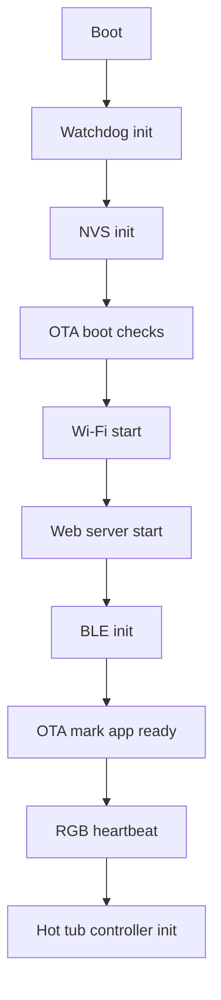

# app_controller Component

Back to project guide: [../../README.md](../../README.md)

## What This Component Does

`app_controller` is the startup orchestrator. It initializes core services in a safe order so the device is usable after boot.

## Why It Exists

Without this component, each module would boot itself and race with others. This file enforces a predictable bring-up order.

## Startup Flow

## Beginner Notes

- If boot fails early, inspect this component first.
- If one module fails, later modules are not started.

## Example

When you call app start, this component does all setup steps and returns `ESP_OK` when ready.

## Troubleshooting

- If web page is unreachable, confirm Wi-Fi and web_server start steps completed.
- If BLE is missing, verify `ble_service_init` path in startup.
