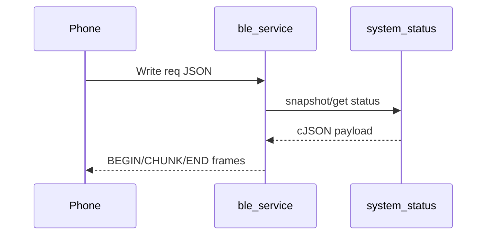

# ble_service Component

Back to project guide: [../../README.md](../../README.md)

## What This Component Does

`ble_service` exposes a custom BLE service with:
- RX characteristic (write/read)
- TX characteristic (notify)

It sends JSON responses and supports command-based requests from BLE terminal apps.

## BLE Messaging Flow



## Framing Format

Large TX payloads are framed as:
- `BEGIN:<msgId>:<totalBytes>:<maxChunkBytes>`
- `CHUNK:<msgId>:<index>/<total>:<data>`
- `END:<msgId>`

## Beginner Commands

Plain text:
- `STATUS`
- `STATUS FULL`
- `STATUS COMPACT`
- `MODE FULL`
- `MODE COMPACT`

JSON request example:

```json
{"id":1,"type":"req","cmd":"system.status.get","params":""}
```

## Connect Behavior

On BLE connect/subscribe, the component sends a short network summary with current mode, SSID, and IP.

## Troubleshooting

- If output looks truncated, reassemble CHUNK frames.
- If no TX appears, ensure notifications are enabled in your BLE app.
