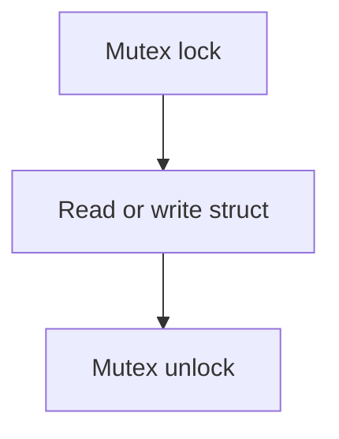

# device_state Component

Back to project guide: [../../README.md](../../README.md)

## What This Component Does

`device_state` is a lightweight shared state container used for quick status fields.

It supports:
- safe snapshot reads
- mutation helpers
- JSON formatting helper for basic state

## Thread Safety Model

## Beginner Explanation

FreeRTOS tasks can run at the same time. Mutex protection avoids data corruption.

## Usage Example

- Update connectivity flags with helper functions.
- Request snapshot for current view.

## Troubleshooting

- If values seem inconsistent, verify every write uses provided setter functions.
