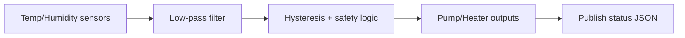
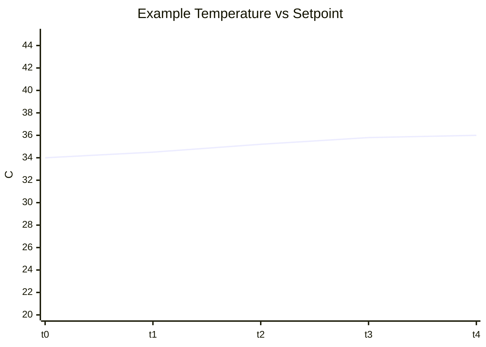

# hot_tub_controller Component

Back to project guide: [../../README.md](../../README.md)

## What This Component Does

`hot_tub_controller` contains the core control logic for water temperature, pump behavior, and heater decisions.

## Control Loop Overview

## Beginner Explanation

The control loop repeats forever:
1. read sensors
2. smooth noisy readings
3. compare against setpoint
4. toggle outputs with hysteresis rules

## Key Data Fields

- `waterTemp`
- `filteredWaterTemp`
- `airTemp`
- `setpointTemp`
- pump/heater state

## Example Behavior Plot

## Troubleshooting

- Oscillation usually means hysteresis thresholds are too tight.
- Flatline temperatures suggest sensor path or conversion issue.
