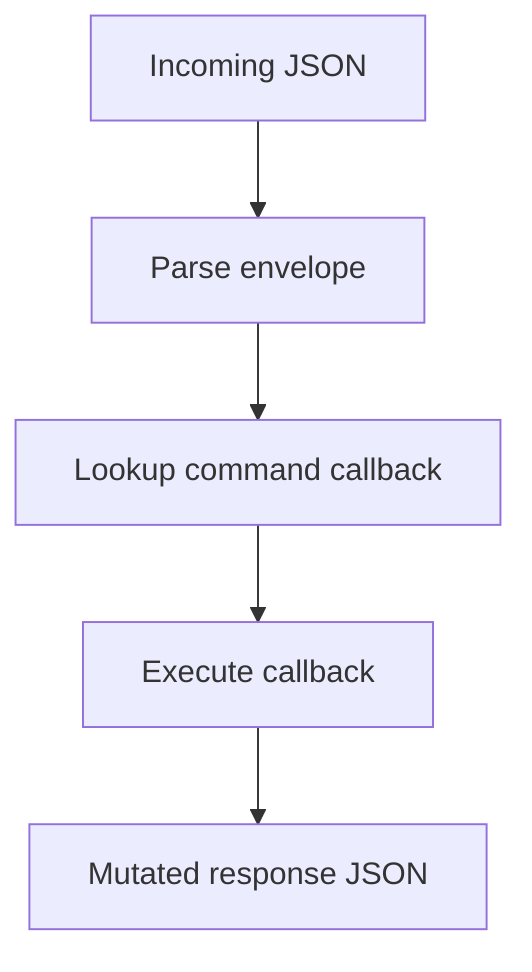

# json_service Component

Back to project guide: [../../README.md](../../README.md)

## What This Component Does

`json_service` is the command router. It:
- registers command handlers
- parses envelopes
- dispatches requests to module callbacks
- supports CRC envelope encode/decode helpers

## Request Lifecycle



## Envelope Example

```json
{"id":1,"type":"req","cmd":"system.status.get","params":""}
```

## Beginner Explanation

This module is like a receptionist: it reads the command name and forwards it to the right subsystem.

## Troubleshooting

- Unknown command means registration is missing or command name mismatch.
- Invalid CRC means payload or envelope got modified in transit.
