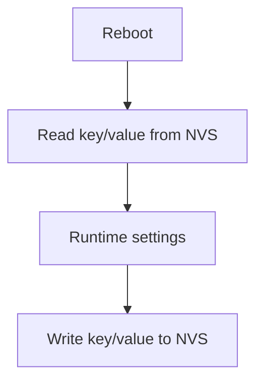

# nvs_storage Component

Back to project guide: [../../README.md](../../README.md)

## What This Component Does

`nvs_storage` manages persistent key/value data in flash memory.

Typical saved items include settings that must survive reboot.

## Storage Model

## Beginner Explanation

NVS is like a small on-device database for configuration.

## Troubleshooting

- If settings reset every boot, check init errors and key namespaces.
- If writes fail, inspect flash partition and return codes.
