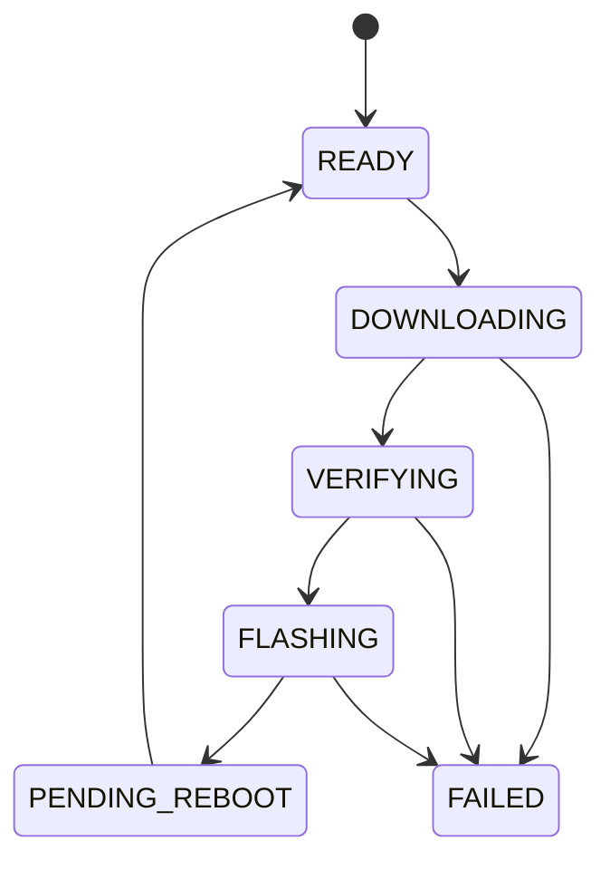

# ota_manager Component

Back to project guide: [../../README.md](../../README.md)

## What This Component Does

`ota_manager` handles over-the-air firmware updates, boot validation, and rollback safety.

## OTA State Flow

## Beginner Explanation

OTA means updating firmware without a USB cable. Safety steps reduce risk of bricking.

## Troubleshooting

- If update fails, inspect download URL and partition size.
- If rollback occurs, app may not have been marked valid after reboot.
