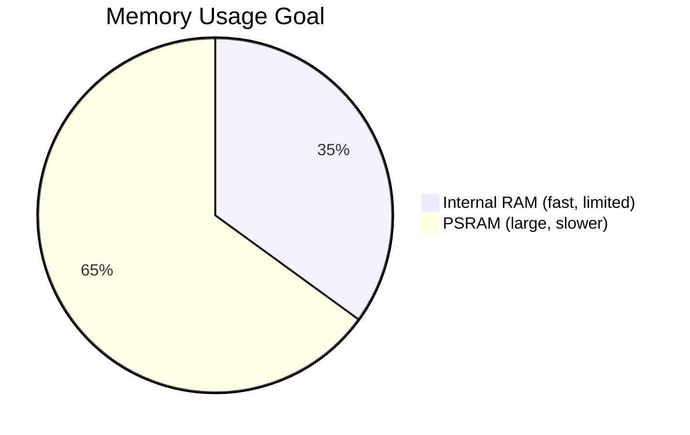

# psram_allocator Component

Back to project guide: [../../README.md](../../README.md)

## What This Component Does

`psram_allocator` provides memory allocation helpers for external PSRAM usage.

## Memory Concept

## Beginner Explanation

Use PSRAM for big buffers so internal RAM remains available for critical real-time tasks.

## Troubleshooting

- Allocation failures may occur if PSRAM not enabled in config.
- Avoid placing latency-sensitive tiny buffers in PSRAM.
