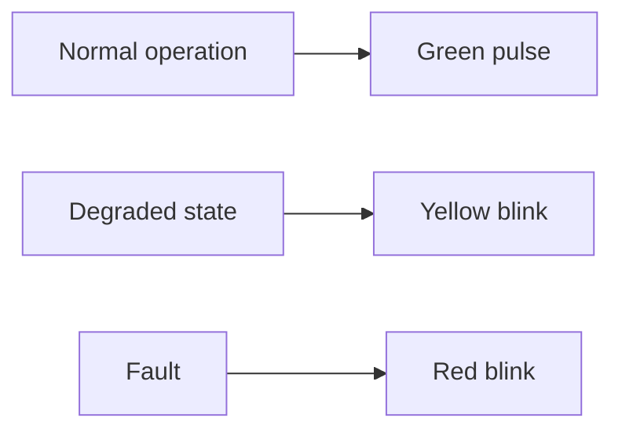

# rgb_led Component

Back to project guide: [../../README.md](../../README.md)

## What This Component Does

`rgb_led` drives status LED behavior such as heartbeat patterns.

## Visual State Concept

## Beginner Explanation

The LED gives immediate status feedback even when no serial terminal is connected.

## Troubleshooting

- No LED output can mean GPIO pin mismatch or LED strip init issue.
