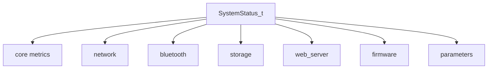

# system_status Component

Back to project guide: [../../README.md](../../README.md)

## What This Component Does

`system_status` owns the master runtime status structure and exports it as JSON.

It includes:
- identity and timestamp
- memory and uptime
- network and BLE state
- storage and web server diagnostics
- firmware/OTA details

## Structure Map



## Beginner JSON Example (trimmed)

```json
{
  "id": 1,
  "device_name": "HotTub",
  "timestamp": "2026-07-31 12:00:00",
  "internal_temperature": 42.1,
  "network": {
    "active_ssid": "HomeWiFi",
    "connected_client_count": 0
  },
  "firmware": {
    "running_partition_slot": 1,
    "current_ota_state": "OTA_READY"
  }
}
```

## Update Lifecycle

1. Snapshot/update functions refresh live metrics.
2. `system_status_get_json()` builds current JSON object.
3. transport layers (BLE/WebSocket) send it to clients.

## Troubleshooting

- Missing fields usually indicate an out-of-date snapshot or transport truncation.
