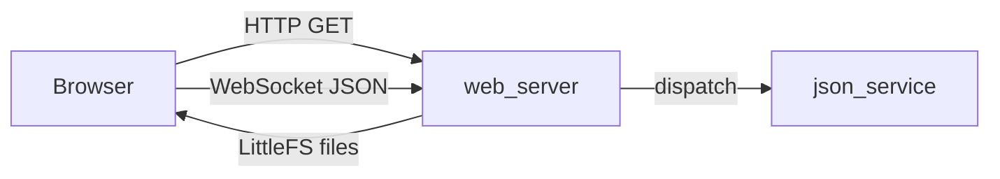

# web_server Component

Back to project guide: [../../README.md](../../README.md)

## What This Component Does

`web_server` serves static UI files from LittleFS and handles WebSocket JSON traffic.

## HTTP + WebSocket Flow

## Beginner Explanation

The web page you open in a browser is hosted by this component. After page load, real-time updates happen through WebSocket.

## Practical Steps

1. Connect device and browser to same network.
2. Open board IP in browser.
3. Watch JSON status updates and send commands.

## Troubleshooting

- If page loads but no live data, inspect WebSocket connection path.
- If static files are stale, reflash LittleFS assets.
