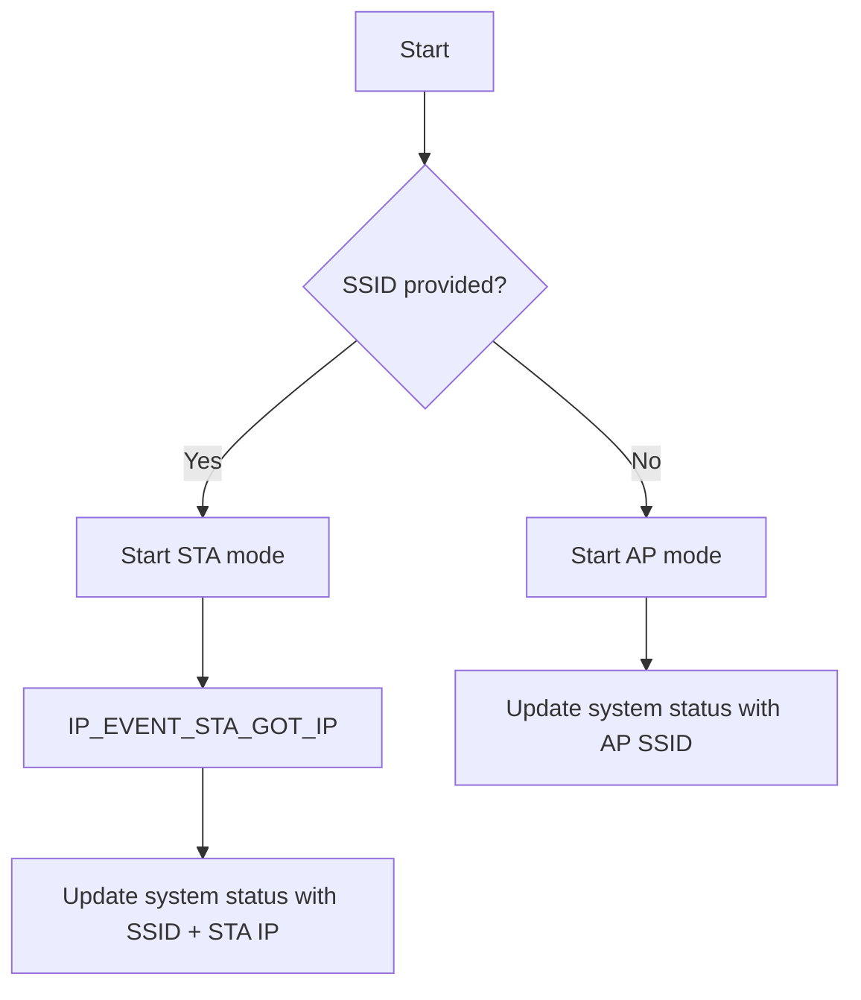

# wifi_manager Component

Back to project guide: [../../README.md](../../README.md)

## What This Component Does

`wifi_manager` starts and monitors Wi-Fi in one of two modes:
- STA mode (connect to existing router)
- AP fallback mode (board hosts its own network)

It tracks STA/AP IP info and publishes wireless status into `system_status`.

## Mode Decision Flow

## Beginner Explanation

If your home Wi-Fi credentials exist, the board joins your router. If not, it starts its own hotspot.

## Example Status Fields

- `current_mode`
- `active_ssid`
- `clients[0].ip_address` for quick IP reference

## Troubleshooting

- STA never connects: check credentials and signal.
- AP missing: verify AP config and channel/auth setup.
